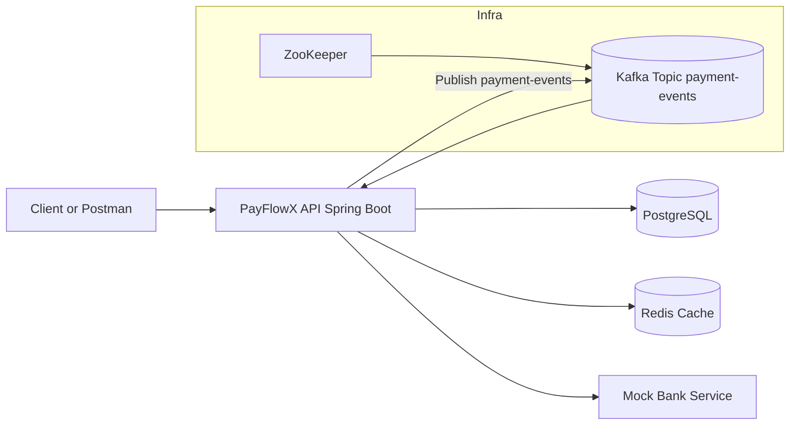

# PayFlowX Backend

## Project Overview

PayFlowX Backend is a Spring Boot payment processing microservice designed for high-throughput request handling and resilient external-bank integration.

The service supports:

- Payment creation with validation
- Payment processing with retry and circuit breaker protections
- Payment status retrieval with Redis cache acceleration
- Kafka event publishing and consumption for payment lifecycle events
- PostgreSQL persistence for payments and payment events

## Tech Stack

- Java 17
- Spring Boot 3.2.5
- Spring Web, Spring Data JPA, Spring Validation, Spring Actuator
- PostgreSQL 16
- Redis 7
- Apache Kafka (Confluent Platform 7.6.1) + ZooKeeper
- Resilience4j (retry and circuit breaker)
- Docker and Docker Compose
- Maven
- Postman

## Architecture



Detailed architecture notes are available in [docs/architecture.md](docs/architecture.md).

## API Endpoints

### Core Endpoints

- GET /api/health
- POST /api/payments
- GET /api/payments/{paymentReference}
- POST /api/payments/{paymentReference}/process

### Operational Endpoint

- GET /actuator/health

## How to Run Locally

### Prerequisites

- Docker Desktop running
- Docker Compose available

### Start the stack

```powershell
docker-compose up --build
```

### Verify containers

```powershell
docker-compose ps
```

Expected services:

- app on port 8080
- postgres on port 5432
- redis on port 6379
- kafka on ports 9092 and 29092
- zookeeper on port 2181

### Stop the stack

```powershell
docker-compose down
```

## Kafka Event Flow

1. Payment is created and stored in PostgreSQL with INITIATED status.
2. Processing endpoint triggers payment validation and mock bank interaction.
3. Final terminal state (SUCCESS or FAILED) is persisted.
4. Service publishes PaymentEventDto to Kafka topic payment-events.
5. Kafka consumer receives event and persists a PaymentEvent audit record in PostgreSQL.

Implementation references:

- Producer: [src/main/java/com/payflowx/backend/service/KafkaPaymentEventProducerService.java](src/main/java/com/payflowx/backend/service/KafkaPaymentEventProducerService.java)
- Consumer: [src/main/java/com/payflowx/backend/service/KafkaPaymentEventConsumerService.java](src/main/java/com/payflowx/backend/service/KafkaPaymentEventConsumerService.java)

## Redis Caching

Payment lookup endpoint uses Redis as a read-through cache for payment responses:

- Cache key pattern: payment:status:{paymentReference}
- TTL: configured by app.cache.payment-status.ttl-minutes (default 30)
- Cache read happens before PostgreSQL query
- Cache write happens after create, get, and process flows

Implementation reference:

- [src/main/java/com/payflowx/backend/service/PaymentServiceImpl.java](src/main/java/com/payflowx/backend/service/PaymentServiceImpl.java)

## Resilience4j Retry and Circuit Breaker

Mock bank integration is protected with both retry and circuit breaker:

- @Retry(name = "bankProcessing")
- @CircuitBreaker(name = "bankProcessing")
- Fallback method handles exhausted retries or open circuit

Key configuration (application.properties):

- Retry max attempts: 3
- Retry wait duration: 1s
- Circuit breaker sliding window size: 10
- Failure rate threshold: 50%
- Open state wait duration: 30s

Implementation references:

- [src/main/java/com/payflowx/backend/service/MockBankServiceImpl.java](src/main/java/com/payflowx/backend/service/MockBankServiceImpl.java)
- [src/main/resources/application.properties](src/main/resources/application.properties)

## Postman Collections

- API collection: [postman/PayFlowX-API.postman_collection.json](postman/PayFlowX-API.postman_collection.json)
- High-volume runner collection: [postman/PayFlowX-High-Volume.postman_collection.json](postman/PayFlowX-High-Volume.postman_collection.json)
- Local environment: [postman/PayFlowX-Local.postman_environment.json](postman/PayFlowX-Local.postman_environment.json)
- Load test data: [postman/payment-load-data.csv](postman/payment-load-data.csv)

## Sample API Requests

Ready-to-run sample requests and responses:

- [docs/sample-api-requests.md](docs/sample-api-requests.md)

## Project Screenshots and Log Screenshots

Runtime snapshots captured from local execution:

- [docs/log-snapshots.md](docs/log-snapshots.md)

## Load Verification Script

After high-volume runs, use:

```powershell
./scripts/verify-after-load.ps1 -ExpectedPayments 200
```

Script file:

- [scripts/verify-after-load.ps1](scripts/verify-after-load.ps1)

## Future Improvements

- Add API authentication and authorization (OAuth2 or JWT)
- Introduce idempotency keys at API boundary for duplicate prevention
- Add OpenAPI/Swagger documentation generation
- Add Grafana dashboards and Prometheus metrics scraping
- Add dead-letter topic strategy and retry-topic handling in Kafka
- Add contract and performance tests in CI pipeline
- Add distributed tracing (OpenTelemetry)
- Add blue-green deployment support and readiness gates