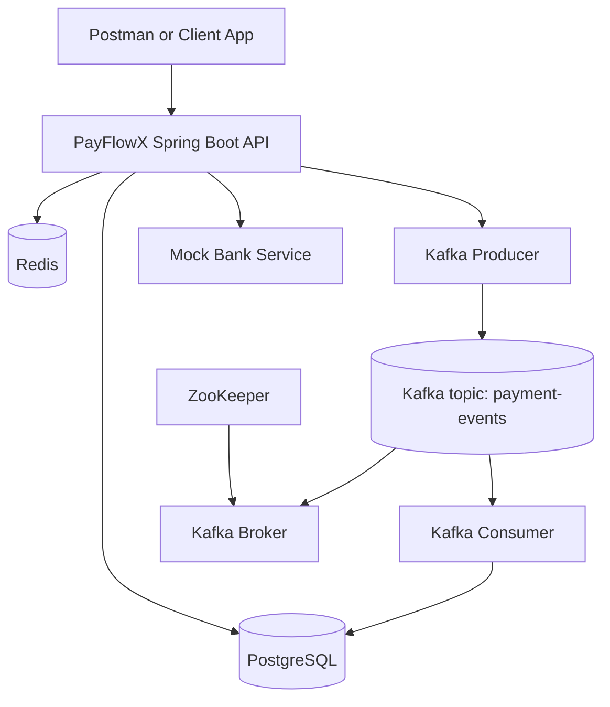

# PayFlowX Architecture

## Component View

## Runtime Roles

- API layer validates requests, orchestrates payment flow, and returns response DTOs.
- PostgreSQL is the source of truth for payments and payment events.
- Redis caches payment status payloads to reduce repeated DB reads.
- Kafka carries terminal payment events (SUCCESS and FAILED) for asynchronous processing.
- Kafka consumer persists event audit records into payment_events table.
- Resilience4j wraps mock bank call with retry and circuit breaker.

## Network and Ports

- API: 8080
- PostgreSQL: 5432
- Redis: 6379
- Kafka external listener: 9092
- Kafka internal listener: 29092
- ZooKeeper: 2181
